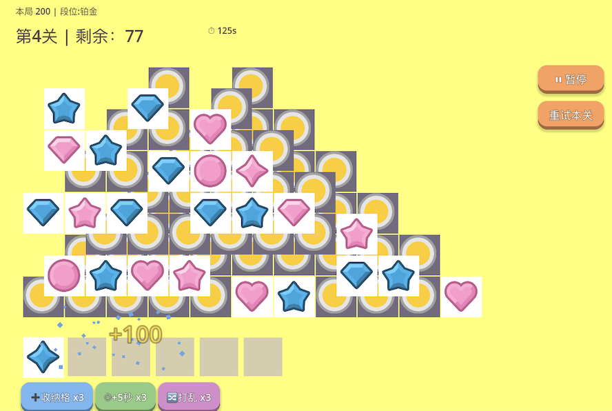
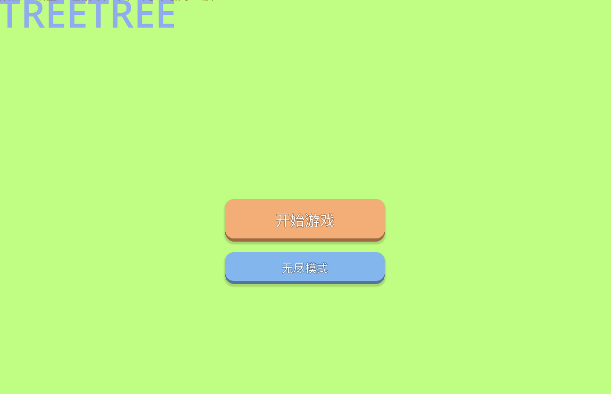

# 方块消除大作战 (Tile Match Puzzle)

[English](README.md) | **中文**
### ▶ [在线试玩](https://zxj-yu.itch.io/tile-match-puzzle) — 无需下载

一款使用 **Godot 4 / GDScript** 从零开发的层叠式三消解谜游戏。在深度堆叠、错综咬合的隐藏方块中层层挖掘，凑齐三个相同即可消除，在限时内清空棋盘。

> 从零开始学习游戏开发的完整实践 —— 涵盖玩法设计、难度平衡、UI/UX、音频与存档系统。

<!-- 截图占位 -->



## ✨ 核心特性

### 玩法
- **信息隐藏挖掘**：被压住的方块只显示卡背 —— 翻开前你永远不知道下面是什么。记忆、推理与风险权衡是核心技巧
- **深度交错堆叠**：每关 3-5 层错位咬合，拿掉一块只露出下层的一角
- **特殊方块**：
  - ❄️ **冰冻块** —— 需点击两次：第一次解冻，第二次才能拿取
  - 🪨 **石头块** —— 永远无法拿取，永久遮挡其覆盖的区域
- **形状关卡**：每关拥有独特轮廓 —— 金字塔、双子塔、菱形、十字、回字、蝴蝶 —— 不同形状需要不同的挖掘策略
- **双游戏模式**：
  - 🗺 **闯关模式** —— 15 个手工设计关卡，机制递进（基础 → 冰冻 → 石头 → 混合 → 高压）
  - ♾ **无尽模式** —— 程序化生成，难度随波次递增

### 系统
- ⏱ **限时挑战**：最后 10 秒红色警告
- ⭐ **星级评价**（1-3星）：按通关用时评定，可重玩刷星
- 🏆 **段位系统**：分数跨局累积，青铜到王者 7 个段位
- 🔥 **连击机制**：快速连续消除，倍率最高 ×3
- 🎒 **道具系统**（每关各 3 次）：扩充收纳格 / +5 秒 / 打乱重排
- 📉 **收纳槽递减**：随关卡推进从 7 格收紧到 5 格
- 💾 **本地存档**：进度、星级、段位、无尽纪录全部持久化
- ⏸ **暂停菜单**：随时暂停、重试或返回主页

### 表现
- 18 种方块图案，随闯关进程逐步引入
- 隐藏方块的卡背美术与翻开动画
- 消除粒子爆散 + 飘分动画
- 糖果风"充气"按钮，带按压下沉反馈
- 完整音效（点击/消除/连击/道具/胜负）+ 循环背景音乐
- 完整界面流：首页 → 关卡选择（含星级记录）→ 游戏

## 🛠 技术要点

| 方面 | 实现 |
|------|------|
| 引擎 | Godot 4.x / GDScript |
| 关卡系统 | **JSON 数据驱动**：布局（含特殊方块编码 `X/I/S`）、限时、槽数、星级标准全部外置 |
| 架构 | 信号（Signal）解耦：玩法、UI、音频、存档各自独立通信 |
| 存档 | 全局单例（Autoload）+ JSON 序列化到 `user://` |
| 音频 | 音效播放器池 + 循环 BGM 的全局 SoundManager |
| 程序化生成 | 无尽模式按波次生成布局，自动保证可解性（方块数为 3 的倍数） |
| 遮挡计算 | 基于层级 + 半格错位的实时遮挡检测，产生交错咬合 |
| 特效 / UI | 粒子、飘字与可复用糖果按钮样式全部纯代码生成 |

## 🎮 如何运行

1. 下载并安装 [Godot 4.x](https://godotengine.org/download)
2. 克隆本仓库：
   ```bash
   git clone https://github.com/zxj-yu/tile-match-puzzle.git
   ```
3. 用 Godot 打开项目文件夹（选择 `project.godot`）
4. 按 `F5` 运行

## 📁 项目结构

```
├── levels.json          # 关卡配置（形状布局/特殊方块/限时/槽数）
├── scenes/
│   ├── Main.tscn        # 主场景（游戏+UI+菜单）
│   └── Item.tscn        # 方块预制体
├── scripts/
│   ├── GridManager.gd   # 核心玩法：生成/遮挡/消除/道具
│   ├── UI.gd            # 界面流转、HUD 与布局样式
│   ├── SaveManager.gd   # 存档单例
│   ├── SoundManager.gd  # 音频单例（音效池 + BGM）
│   ├── LevelSelect.gd   # 关卡选择界面
│   ├── TitleScreen.gd   # 首页
│   ├── Item.gd          # 方块行为（普通/冰冻/石头、卡背）
│   ├── ButtonStyler.gd  # 可复用糖果按钮样式
│   ├── FloatingText.gd  # 飘分特效
│   └── BurstParticle.gd # 粒子特效
└── resources/           # 美术与音频素材
```

## 🗺 开发路线

- [x] 核心消除玩法与遮挡机制
- [x] 信息隐藏卡背
- [x] 特殊方块（冰冻/石头）与机制递进的关卡设计
- [x] 形状化关卡轮廓（金字塔/双塔/菱形/十字/...）
- [x] 闯关 / 无尽双模式
- [x] 限时 + 星级 + 段位 + 连击 + 道具
- [x] 音效与背景音乐
- [x] 糖果风 UI 按钮
- [x] 统一视觉主题
- [x] 更多特殊方块（炸弹/锁链）
- [x] 导出 Web 版发布至 itch.io

## 📄 素材声明

- 游戏美术素材来自 [Kenney.nl](https://kenney.nl)（CC0 许可）
- 音乐：**"Holiday Weasel"** by Kevin MacLeod（[incompetech.com](https://incompetech.com)）
  基于 [Creative Commons: By Attribution 4.0](https://creativecommons.org/licenses/by/4.0/) 许可使用
- 字体：[得意黑](https://github.com/atelier-anchor/smiley-sans)（SIL Open Font License 1.1）
---

*本项目为从零学习 Godot 4 游戏开发的自主实践作品。*
